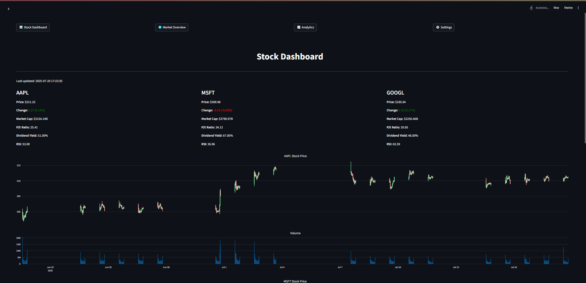
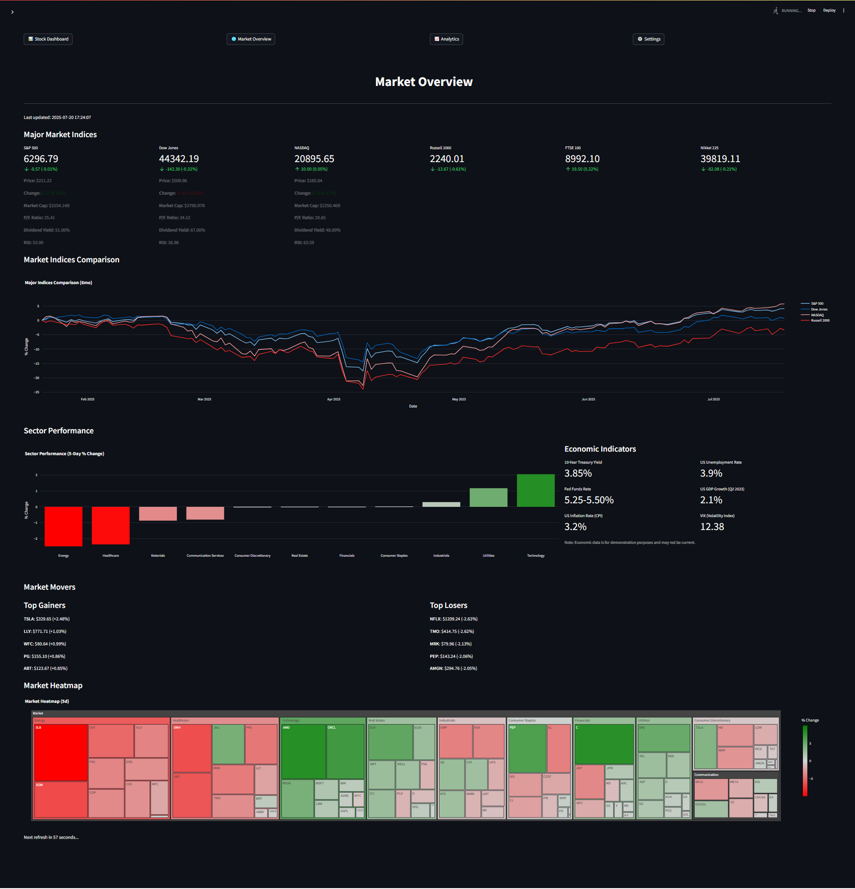
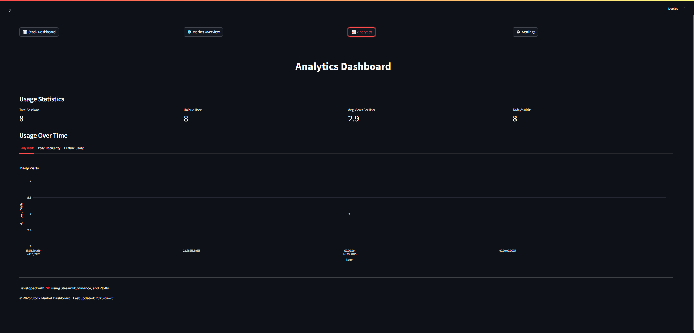
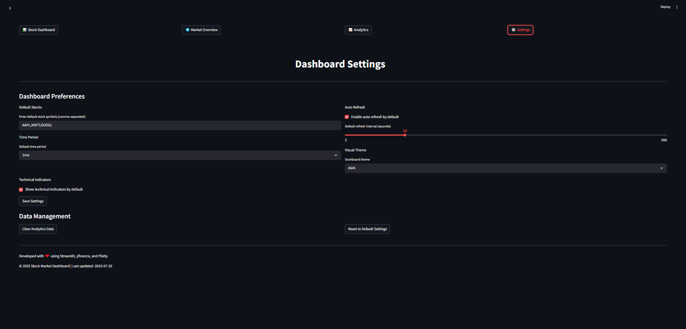

# Real-Time Stock Market Dashboard

A professional, interactive dashboard for tracking and visualizing live stock market data built with Python and Streamlit.

## Features

- **Real-time Stock Data**: Live updates of stock prices and key metrics
- **Interactive Charts**: Candlestick charts, volume indicators, and technical analysis
- **Market Overview**: Market indices, sector performance, and economic indicators
- **Stock Search**: Easily find and track any publicly traded company
- **Customizable**: Select stocks, time periods, and chart types
- **Technical Indicators**: Moving averages, RSI, MACD, and more
- **Auto-refresh**: Configurable data refresh intervals
- **Analytics**: Comprehensive usage tracking and dashboard analytics
- **All-in-One Interface**: Unified experience with intuitive navigation

## Screenshots

The dashboard includes multiple views accessible from a single interface:

1. **Stock Dashboard**: Individual stock performance with charts and key metrics

2. **Market Overview**: Broad market performance with indices and sectors

3. **Analytics**: Usage statistics and feature popularity

4. **Settings**: Customize your dashboard experience


## Installation

### Prerequisites

- Python 3.8 or higher

### Setup

1. Clone the repository:
```
git clone https://github.com/yourusername/real-time-stock-dashboard.git
cd real-time-stock-dashboard
```

2. Install dependencies:

```
pip install -r requirements.txt
```

## Usage

Simply run the dashboard with a single command:

```
streamlit run dashboard.py
```

Access the dashboard in your browser at `http://localhost:8501`

### Features

- **Unified Navigation**: Switch between different views without leaving the app
- **Stock Search**: Find and add any stock to your tracking list
- **Customizable Settings**: Configure defaults and preferences
- **Data Auto-refresh**: Real-time updates at customizable intervals
- **Technical Analysis**: View indicators directly on the charts
- **Usage Analytics**: Track your dashboard interaction patterns

## Project Structure

```
real-time-stock-dashboard/
├── dashboard.py           # Main consolidated dashboard application
├── app.py                 # Legacy individual stock dashboard
├── market_dashboard.py    # Legacy market overview dashboard
├── analytics_dashboard.py # Standalone analytics dashboard
├── analytics.py           # Analytics tracking utilities
├── stock_utils.py         # Utility functions for stock data processing
├── market_overview.py     # Market overview data and visualizations
├── main.py                # Entry point for running the application
├── requirements.txt       # Project dependencies
├── .python-version        # Python version specification
└── README.md              # Project documentation
```

## Technology Stack

- **Python**: Core programming language
- **Streamlit**: Web application framework
- **Pandas**: Data manipulation and analysis
- **yfinance**: Yahoo Finance API wrapper for market data
- **Plotly**: Interactive data visualization

## Future Improvements

- Portfolio tracking and performance analysis
- User accounts and saved preferences
- Additional technical indicators
- Alerts and notifications for price movements
- News integration for relevant stocks

## License

This project is licensed under the MIT License - see the [LICENSE](LICENSE) file for details.

## Acknowledgments

- Data provided by Yahoo Finance via yfinance
- Streamlit for the easy-to-use web framework
- Plotly for interactive visualizations

## Contact

For questions or feedback, please contact:
- Your Name - your.email@example.com
- Project Link: https://github.com/yourusername/real-time-stock-dashboard 